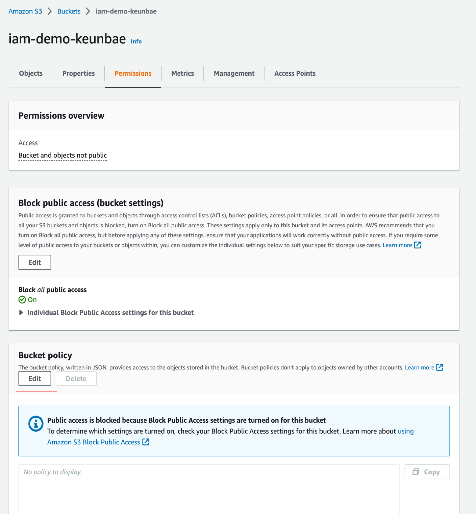
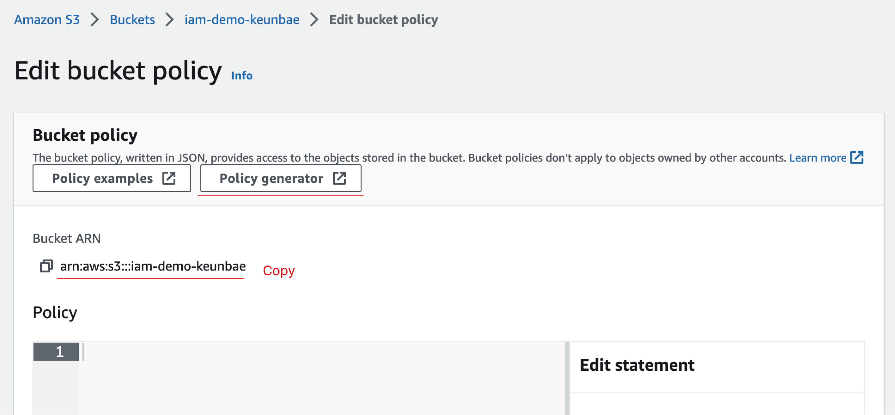
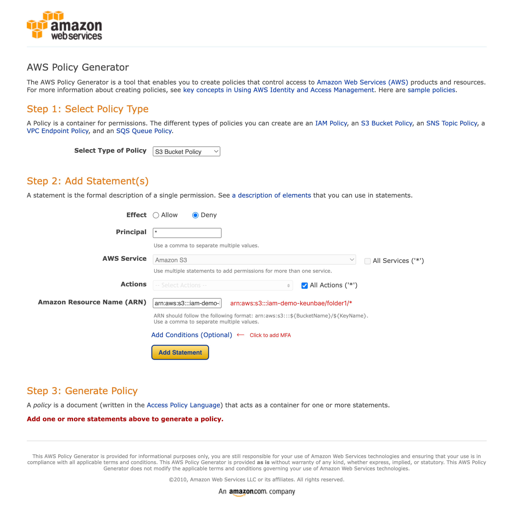
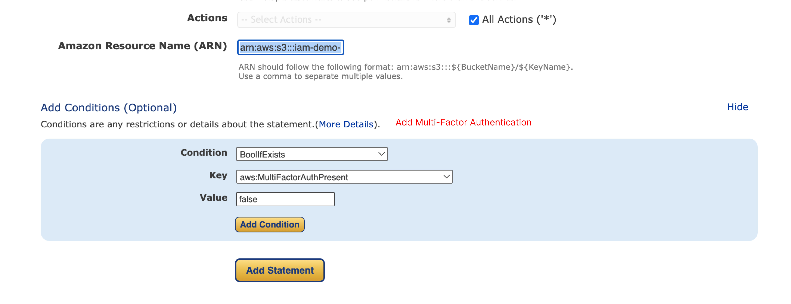
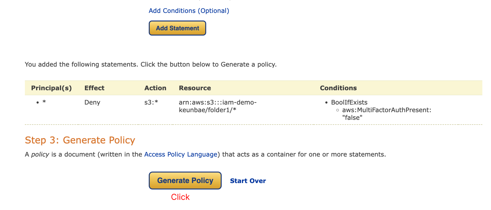
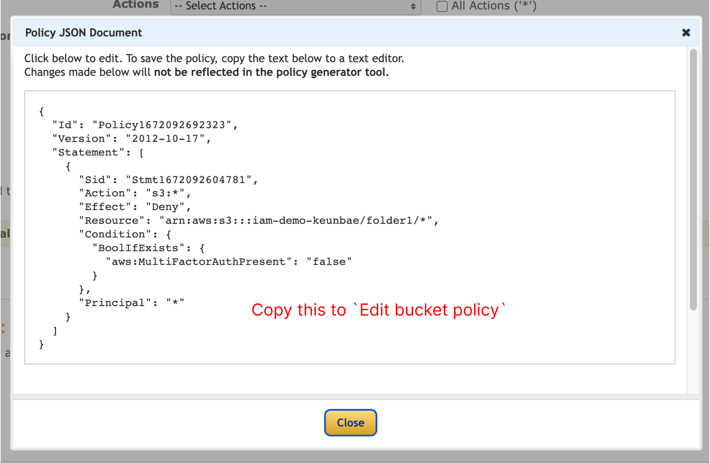
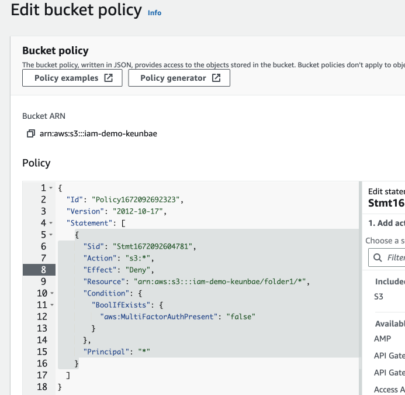
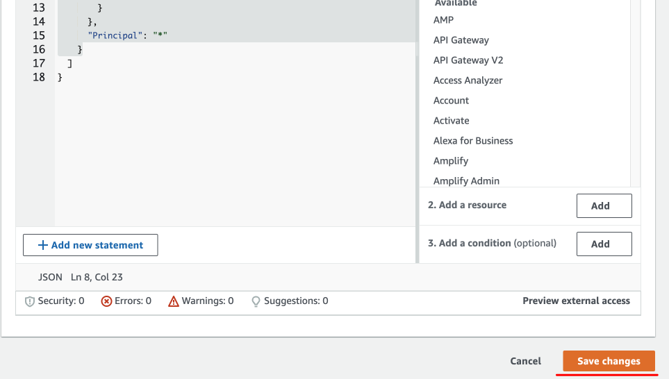
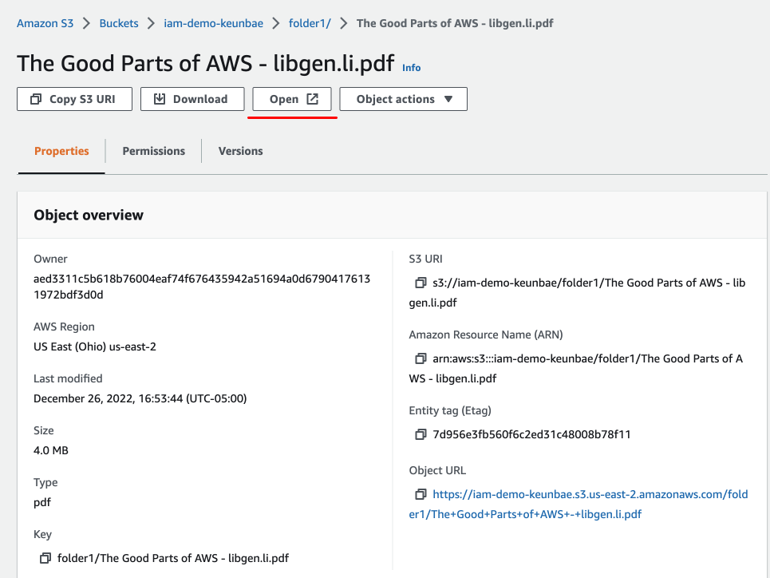

# Add a policy to a bucket

All actions on s3 are denied specifically on this resource `folder1/*` under the certain condition that if you have a boolean value of `false` associated with `MultiFactorAuthPresent`.

If you have `true`, you have access to it.

It applies to all pricipals.

Based on this policy, user1 can't open the file. But user2 can open the file.
