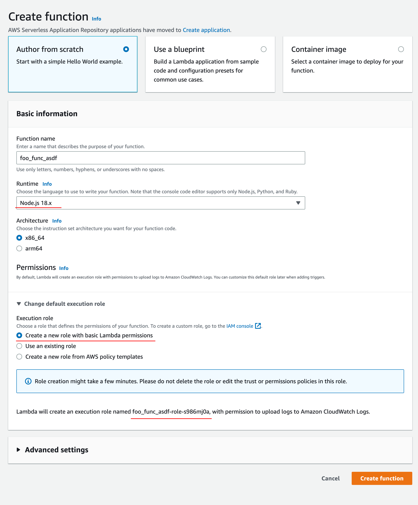
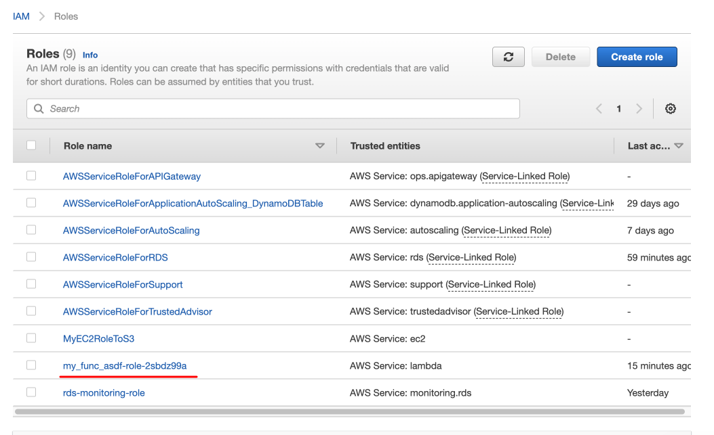
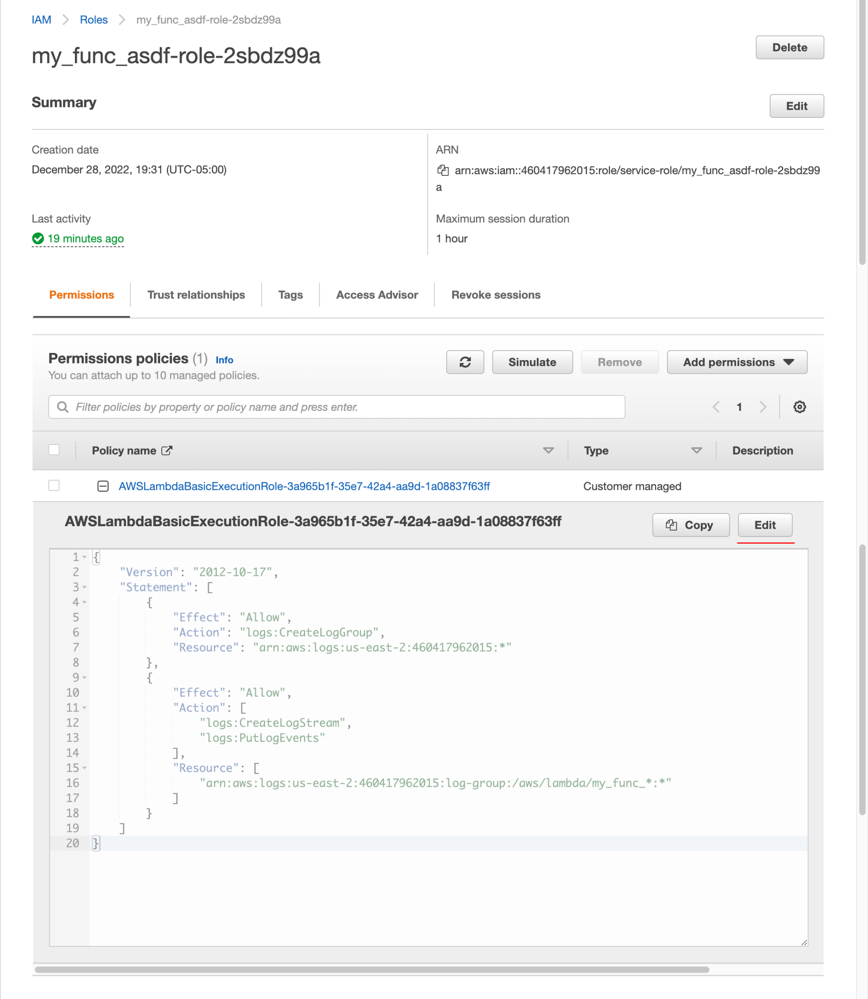
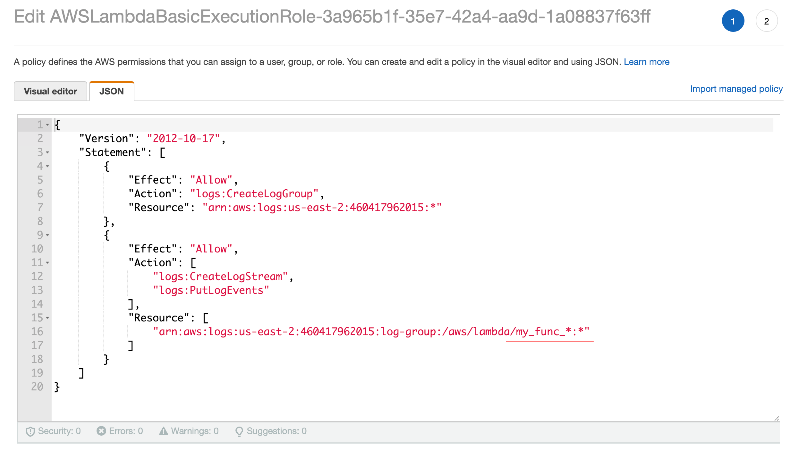
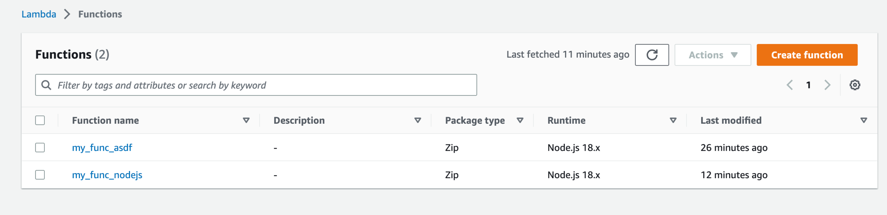
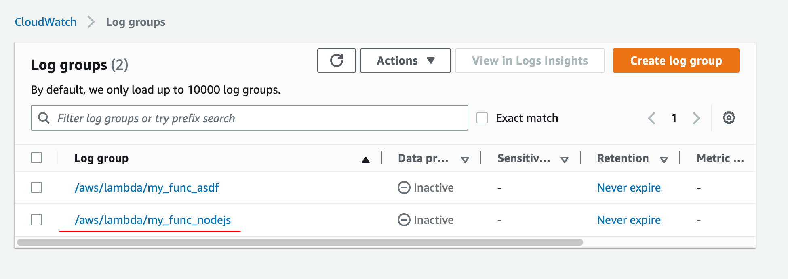
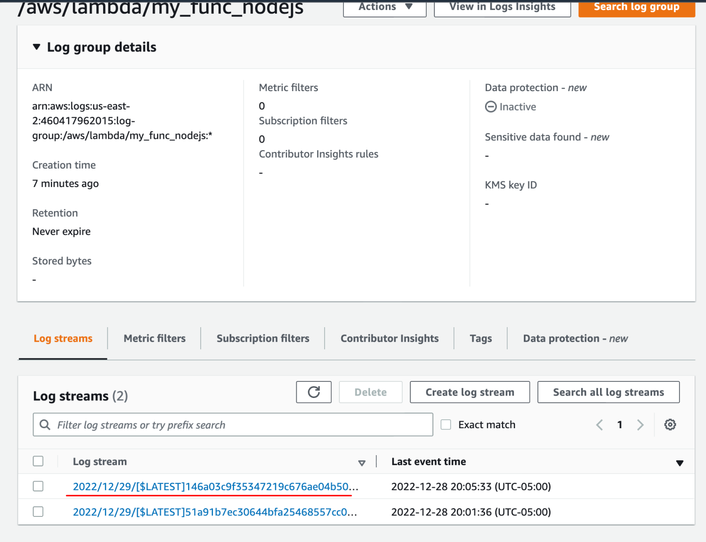
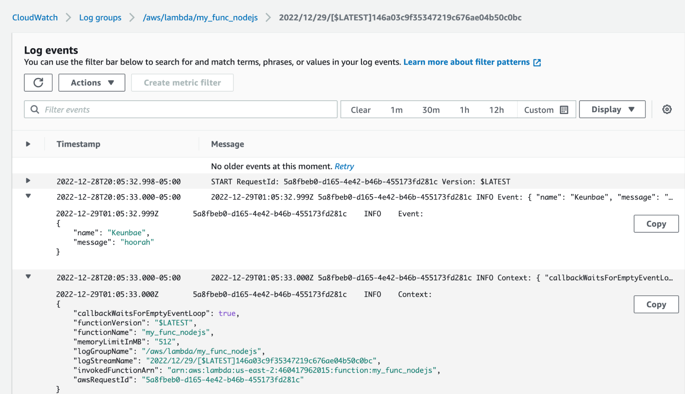

# Create a lambda function



> This also creates a role for logging. We will make this role usable for other lambda function.





Create a lambda function.

Create a zip file.

```sh
zip index.zip index.js
```

Deploy

```sh
aws [--profile <profile>]lambda create-function \
--function-name my_func_nodejs \
# This is the role created above
--role arn:aws:iam::460417962015:role/service-role/my_func_asdf-role-2sbdz99a \
--runtime nodejs18.x \
--handler index.handler \
--memory-size 512 \
--zip-file fileb://index.zip
```



Invoke the function

```sh
aws lambda invoke \
--function-name my_func_nodejs \
--invocation-type RequestResponse \
--cli-binary-format raw-in-base64-out \
--payload '{"name": "Keunbae", "message": "hoorah"}' \
output.json
```




