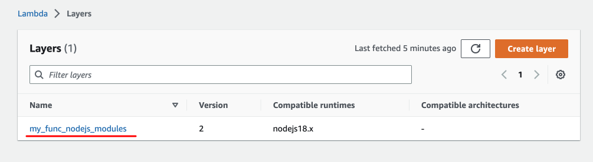
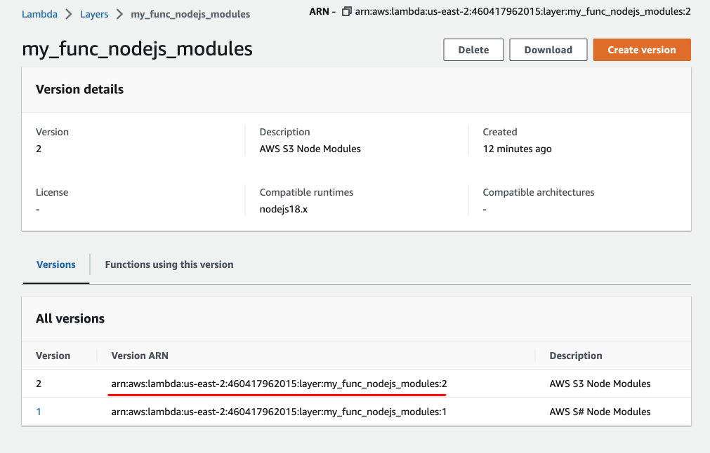
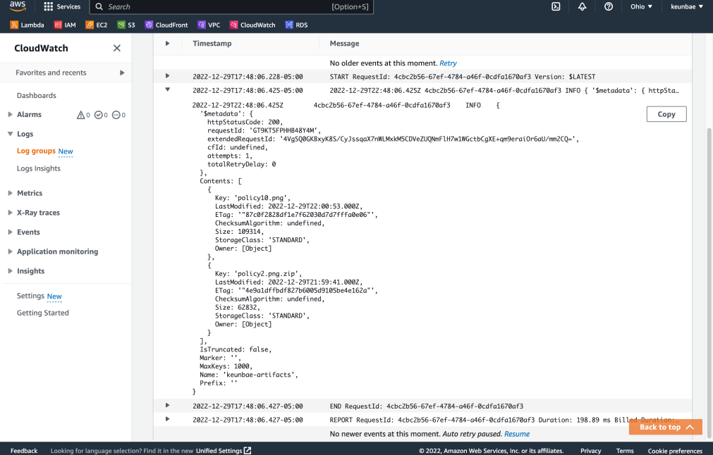

# Update a lambda function

```sh
npm init

npm install @aws-sdk/client-s3

zip -r9q index.zip . -x 'output.json' -x 'doc'
# -x: exclude
# -r: recursively

# update lambda function
aws lambda [--profile <your-profile>] update-function-code \
--function-name my_func_nodejs \
--zip-file fileb://index.zip \
--publish

# invoke
aws lambda invoke \
--function-name my_func_nodejs \
--invocation-type RequestResponse \
output.json

cat output.json
```

> Go to 'cloudwatch' and see the logs of this lambda function

> You will see the list of objects from the bucket 'keunbae-artifacts'.

# Create a layer

```sh
mkdir -p layer/nodejs

cp -r node_modules package* layer/nodejs/

cd layer

zip -r9q layer.zip .

# publish layer
aws lambda publish-layer-version \
--layer-name my_func_nodejs_modules \
--description 'AWS S3 Node Modules' \
--zip-file fileb://layer.zip \
# --compatible-runtimes nodejs : could be just 'nodejs'
--compatible-runtimes nodejs18.x
```

> Go to 'Lambda > Layers' to see the published layer.



# Add a layer to a function

```sh
aws lambda update-function-configuration \
--function-name my_func_nodejs \
--layers "arn:aws:lambda:us-east-2:460417962015:layer:my_func_nodejs_modules:2"
```



# Remove node_modules from function

```sh
# zip only index.js
zip -r9q index.zip index.js

# update function
aws lambda update-function-code \
--function-name my_func_nodejs \
--zip-file fileb://index.zip \
--publish

aws lambda invoke \
--function-name my_func_nodejs \
--invocation-type RequestResponse \
output.json
```


