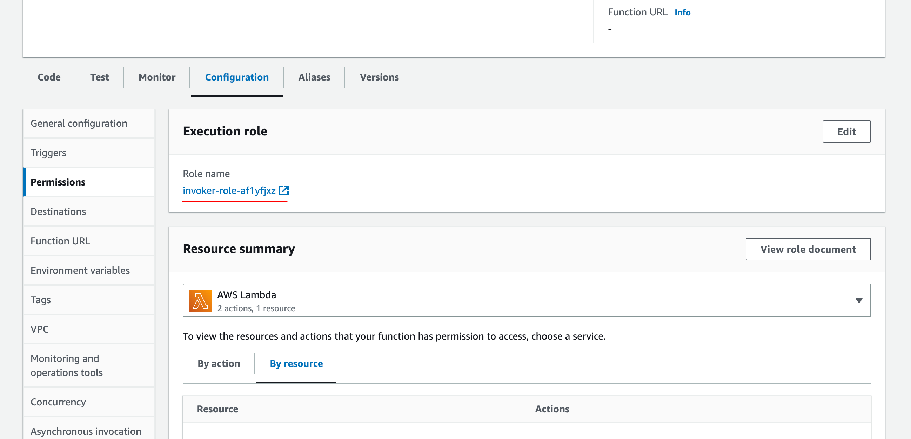
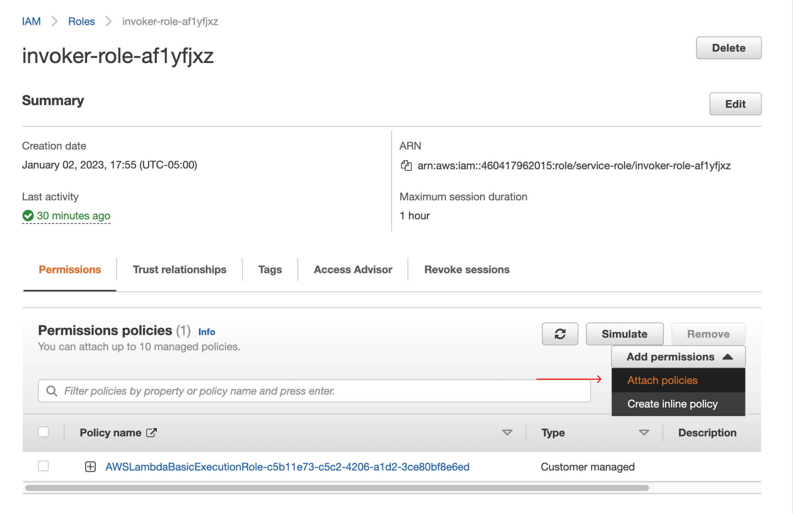
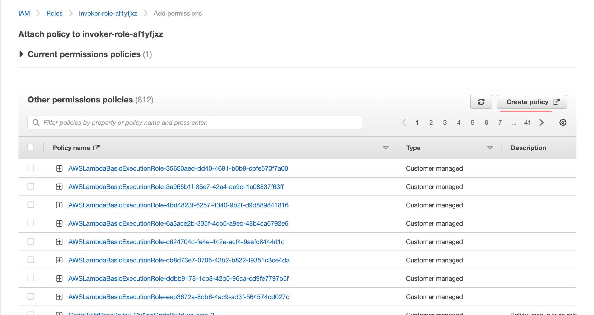
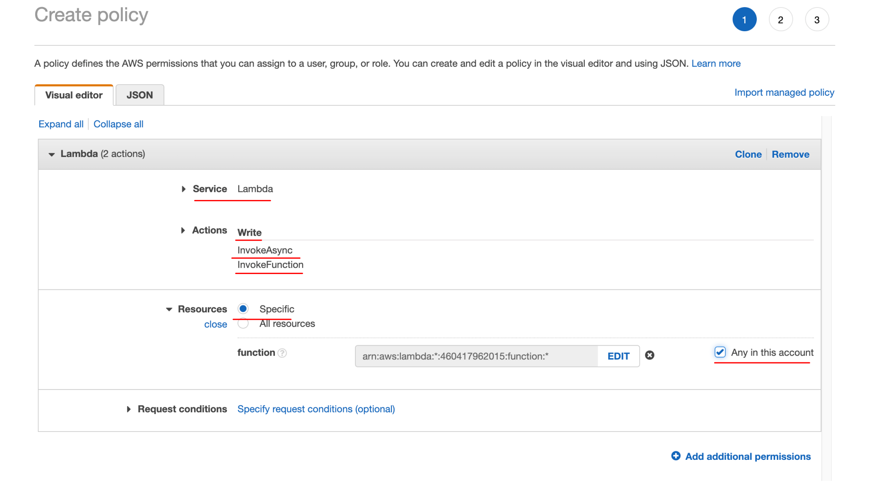
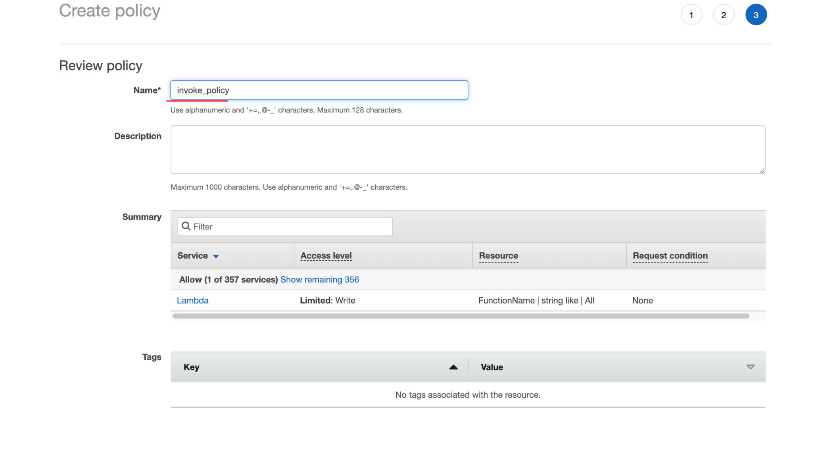
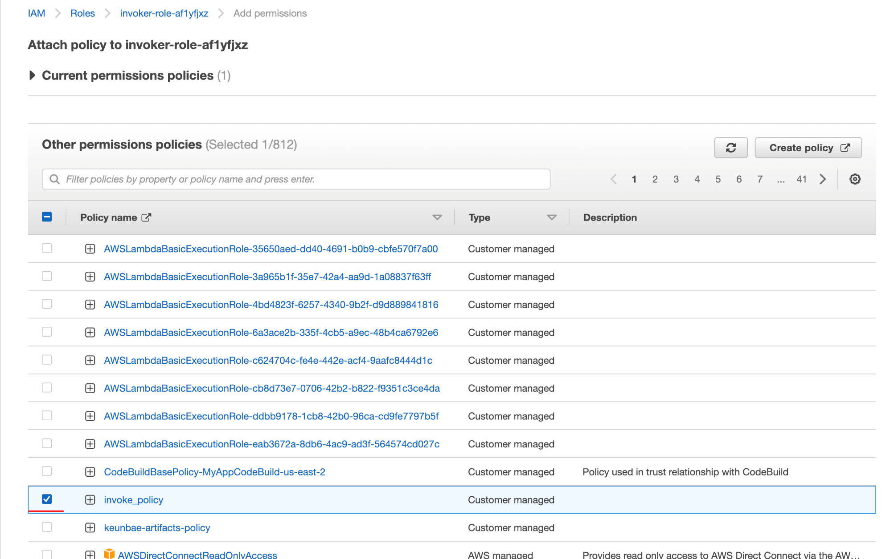
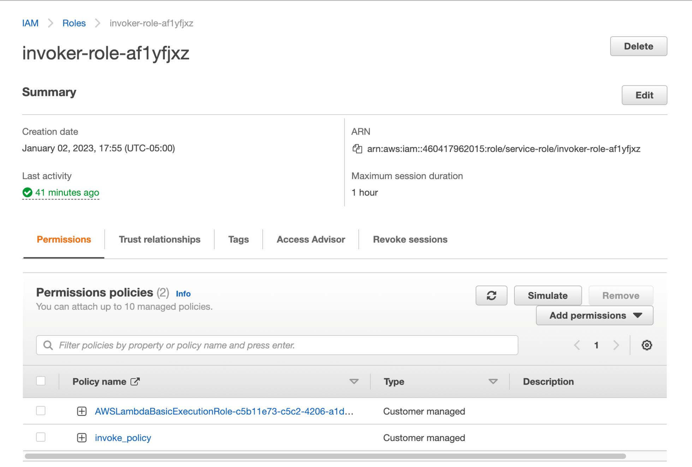
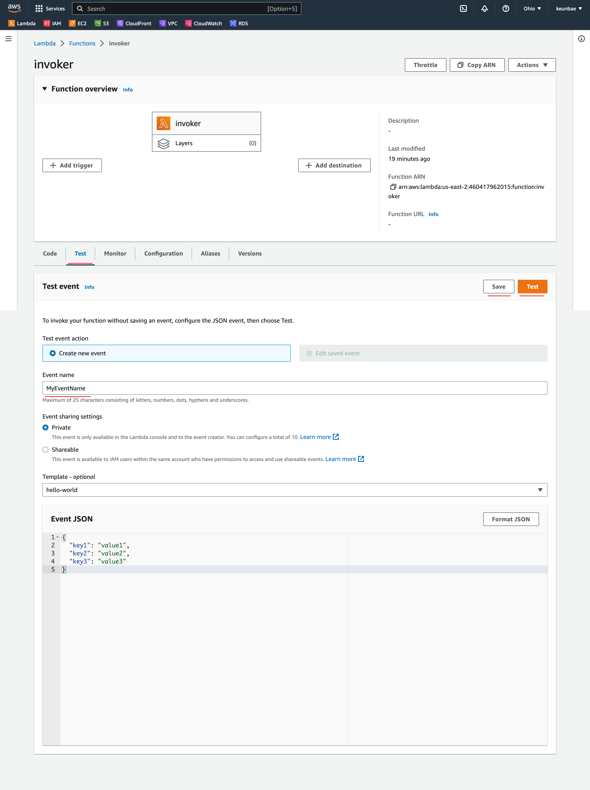

# Create a function

> Handler field: function_filename.actual_function_name

```sh
# publish
aws lambda create-function \
--function-name invoker \
--runtime python3.9 \
--handler lambda_function.lambda_handler \
--role arn:aws:iam::460417962015:role/service-role/invoker-role-af1yfjxz \
--zip-file fileb://lambda_function.zip


# update
rm lambda_function.zip

# -q: quiet
# -x: exclude
zip -r9q lambda_function.zip . -x README.md -x output.json -x images/\*

aws lambda update-function-code \
--function-name invoker \
--zip-file fileb://lambda_function.zip \
--publish

# invoke
aws lambda invoke \
--function-name invoker \
--invocation-type RequestResponse \
--cli-binary-format raw-in-base64-out \
output.json
```

# Add policy for invoking other lambdas










# Create a test for a lambda


