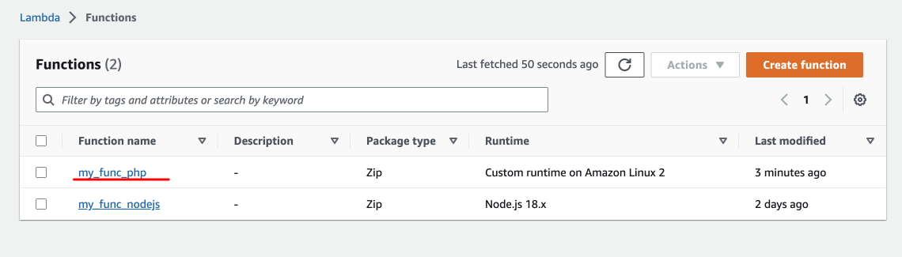
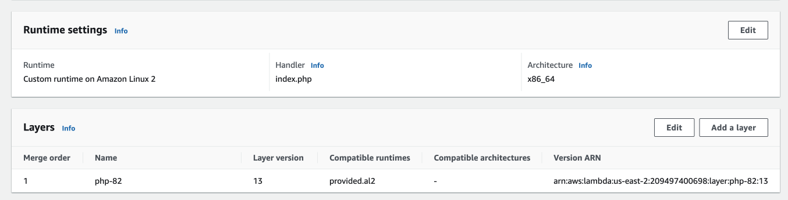
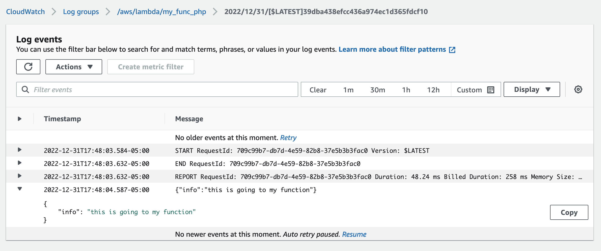
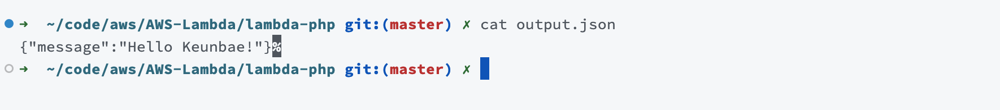

# Bref runtimes

https://runtimes.bref.sh/?region=us-east-2

# Create a function

```sh
composer init

> Would you like to define your dependencies (require) interactively [yes]? yes
> Search for a package: bref/bref

# zip everything in this directory.
zip -r9q index.zip . -x readme.md -x output.json -x images/\*

# publish
aws lambda create-function \
--function-name my_func_php \
--role arn:aws:iam::460417962015:role/service-role/my_func_asdf-role-2sbdz99a \
--runtime provided.al2 \ # aws official runtime, empty shell, amazon linux(centos)
--handler index.php \ # your php filename
--memory-size 512 \
--layers "arn:aws:lambda:us-east-2:209497400698:layer:php-82:13" \ # from bref
--zip-file fileb://index.zip

# update
# You should zip the file again before updating
rm index.zip

zip -r9q index.zip . -x readme.md -x output.json -x images/\*

aws lambda update-function-code \
--function-name my_func_php \
--zip-file fileb://index.zip \
--publish

# invoke
aws lambda invoke \
--function-name my_func_php \
--invocation-type RequestResponse \
--cli-binary-format raw-in-base64-out \
--payload '{"name": "Keunbae"}' \
output.json

```





